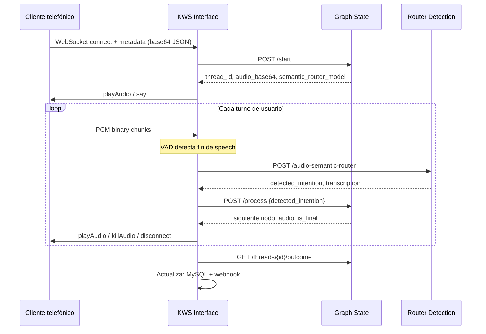

## Secuencia IVR clásico (`native_audio`)

Este es el camino más usado en cobranza y encuestas: el router clasifica intención sobre audio sin que Graph State ejecute STT.



## Pipeline `transcription`

Graph State indica `audio_pipeline: transcription`. El cliente o un servicio STT externo convierte audio a texto; Interface usa la ruta de texto:

```http
POST /threads/{thread_id}/process
{ "user_input": "sí quiero pagar mañana" }
```

Graph State aplica coincidencia por palabras clave (`IntentionDetector`), no llama al router en este modo.

## Pipeline `llm`

Para routers personalizados (`semantic_router_model` fuera del catálogo MLflow estándar), Graph State devuelve `llm_intentions`. Un servicio LLM externo clasifica; Interface envía el resultado a:

```http
POST /process
{ "thread_id": "...", "detected_intention": "CUSTOM_KEY" }
```

## Respuesta del router

Ejemplo simplificado de **Router Detection**:

```json
{
  "transcription": "sí",
  "detected_intention": "AFFIRM",
  "score": 0.94,
  "router_model": "yes_no"
}
```

Interface mapea la intención al formato que espera Graph State y registra la clasificación en MySQL (`ivr_router`).

## Finalización de llamada

<Steps>
  <Step title="Nodo final o límite de turnos">
    Graph State devuelve `is_final: true` o Interface alcanza `MAX_CONVERSATION_TURNS`.
  </Step>
  <Step title="Outcome">
    `GET /threads/{thread_id}/outcome` devuelve JSON estructurado (pago, método, hangup, etc.).
  </Step>
  <Step title="Webhook">
    Interface hace `POST {WEBHOOK_API_URL}/webhooks/save-call-metadata` de forma asíncrona.
  </Step>
  <Step title="Desconexión">
    Mensaje WebSocket `{ "type": "disconnect", "completed": true }` y cierre del socket.
  </Step>
</Steps>

## Métricas y calidad

KWS Interface calcula por utterance y por llamada:

- Ratio de voz VAD, choppiness, SNR aproximado
- Score medio de clasificación (excluyendo 0, None y 100)
- Conteo de clasificaciones bajo 70% de certeza

Router Detection puede registrar filas en `drift_workspace/current/drift_observations.jsonl` para reportes Evidently (`POST /drift/generate`).
