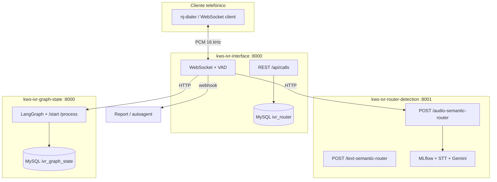

## Diagrama de componentes



## Separación de responsabilidades

| Capa | Responsabilidad | No hace |
|------|-----------------|---------|
| **KWS Interface** | Sesión en tiempo real, VAD, barge-in, TTS, métricas de llamada, webhook al colgar | No define transiciones del grafo ni entrena modelos |
| **Router Detection** | STT, embeddings, clasificación MLflow, drift, dashboard de lectura vía Calls API | No persiste hilos ni reproduce audio al usuario |
| **Graph State** | Definición del grafo, estado del hilo, audio de nodos, outcomes | No transcribe audio ni abre WebSocket con el teléfono |

## Contrato entre servicios

**Graph State → Interface (respuesta de turno)**

Cada respuesta de `/start` o `/process` incluye campos que el orquestador debe interpretar:

- `audio_pipeline`: `transcription`, `native_audio` o `llm`
- `semantic_router_model`: perfil del router (por ejemplo `yes_no`, `auth`)
- `audio_base64` o `response` (texto para TTS en el cliente)
- `is_final`, `thread_id`, `current_node`

**Interface → Router Detection**

```http
POST /audio-semantic-router
X-API-Key: <SEMANTIC_ROUTER_API_KEY>
Content-Type: multipart/form-data
```

Campos habituales: `audio_file`, `router_model`, `call_id`, `language=es-MX`, `current_node`, `turn_number`.

**Interface → Graph State**

```http
POST /start
POST /process
```

Ver [Flujo de datos](/architecture/data-flow) para el detalle por `audio_pipeline`.

## Modos alternativos

**Voice-to-voice** en KWS Interface omite el ciclo router + process clásico y enlaza el WebSocket con xAI u OpenAI Realtime cuando `mode` en metadata es `xai_realtime` o `openai_realtime`. El prompt puede cargarse desde `GET /graphs/{graph_id}` de Graph State.

## Repositorios

| Proyecto | Repositorio |
|----------|-------------|
| KWS Interface | `kws-ivr-interface` |
| Router Detection | `kws-ivr-router-detection` |
| Graph State | `kws-ivr-graph-state` |
