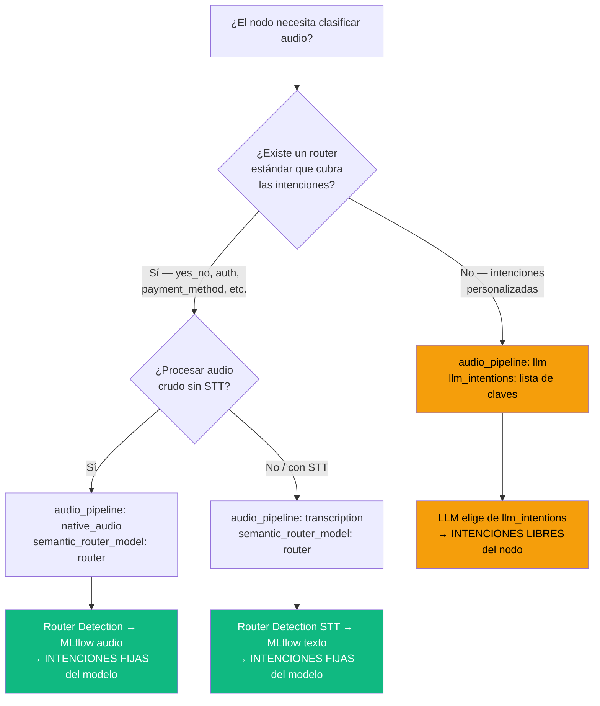
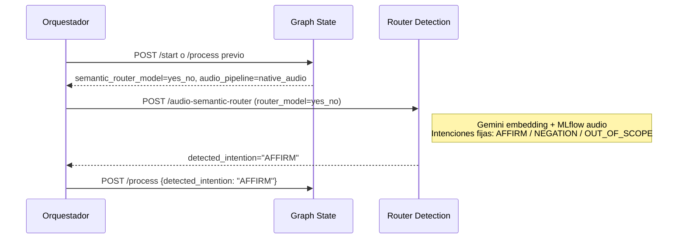
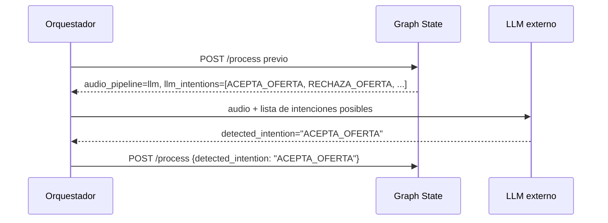

Cada respuesta de `/start` o `/process` incluye `audio_pipeline`. **Graph State no llama** a STT ni al router; solo indica el contrato al orquestador (KWS Interface).

## Resumen

| Pipeline | Quién transcribe/clasifica | Endpoint Graph State |
|----------|--------------------------|----------------------|
| `native_audio` | Router Detection (`audio_pipeline=native_audio`) | `POST /process` con `detected_intention` |
| `transcription` | STT externo + keywords en Graph State | `POST /threads/{id}/process` con `user_input` |
| `llm` | LLM externo con `llm_intentions` | `POST /process` con `detected_intention` |

---

## Routers estándar y sus intenciones fijas

Router Detection precarga al arranque (`TEXT_ROUTER_ROUTERS`) los siguientes routers. Cuando un nodo usa `native_audio` o `transcription` con uno de estos modelos, **las intenciones son las del modelo MLflow entrenado — no son modificables en el nodo**.

| `semantic_router_model` | Intenciones disponibles |
|-------------------------|-------------------------|
| `yes_no` | `AFFIRM` · `NEGATION` · `OUT_OF_SCOPE` |
| `auth` | `AFFIRM` · `NEGATION` · `DECEASED` · `OUT_OF_SCOPE` |
| `payment_method` | `PAYMENT_CARD` · `PAYMENT_TRANSFER` · `PAYMENT_CASH` · `ALREADY_PAID` · `GO_BACK` · `OUT_OF_SCOPE` |
| `no_payment` | `WORK_RELATED_REASONS` · `ECONOMIC_INSOLVENCY` · `HEALTH_REASONS` · `PAY_LATER` · `BALANCE_COMPLAINT` · `DOES_NOT_RECOGNIZE_CREDIT` · `OUT_OF_SCOPE` |
| `ciudad_sede` | `GUADALAJARA` · `MONTERREY` · `CDMX` · `OUT_OF_SCOPE` |
| `expectativa` | `OCTAVOS` · `CUARTOS` · `QUINTO_PARTIDO` · `OUT_OF_SCOPE` |
| `rival` | `BRASIL` · `ARGENTINA` · `ESPANA` · `OUT_OF_SCOPE` |
| `interest_branch` | Según modelo entrenado · `OUT_OF_SCOPE` |

<Warning>
  Si el nodo usa `native_audio` o `transcription` con un router estándar, **solo puede recibir las intenciones listadas arriba**. Las claves de transición del nodo deben coincidir exactamente con esos valores. Para intenciones distintas, usar `audio_pipeline: "llm"`.
</Warning>

---

## Árbol de decisión: ¿qué pipeline usar?



### Regla de oro

```
Router estándar  →  native_audio  o  transcription  →  intenciones FIJAS del modelo
Router custom    →  llm  (siempre)                  →  intenciones LIBRES del nodo
```

---

## `native_audio` (más común en producción)



---

## `transcription`

1. Router Detection transcribe con cadena STT (Groq → xAI → Deepgram → OpenAI → Google)
2. Clasifica con embeddings OpenAI + MLflow text router
3. Las intenciones resultantes son las del modelo — **iguales que en `native_audio`**

```http
POST /threads/{thread_id}/process
```

```json
{
  "user_input": "quiero pagar el viernes"
}
```

---

## `llm` — obligatorio para routers custom

<Warning>
  Todo router que **no sea uno de los estándar** de la tabla anterior **debe usar `audio_pipeline: "llm"`** en el nodo. No existe soporte MLflow para routers arbitrarios.
</Warning>

Graph State devuelve `llm_intentions` con las claves de transición válidas definidas en el nodo. Un servicio LLM (Gemini 2.5 Flash → GPT-4.1 nano → Grok) elige una; el orquestador envía `detected_intention` a `POST /process`.

```json
{
  "audio_pipeline": "llm",
  "llm_intentions": ["ACEPTA_OFERTA", "RECHAZA_OFERTA", "PIDE_MAS_INFO"]
}
```



Ver `mcp/GRAPH_CREATION_RULES.md` en el repositorio graph-state para restricciones adicionales.

---

## Audio de salida

- Preferir `audio_base64` precargado en el nodo
- Si solo hay `response` texto, KWS Interface usa TTS (`say` o OpenAI/xAI)
- Subir audio: `POST /graphs/{id}/node/{node_id}/audio`
