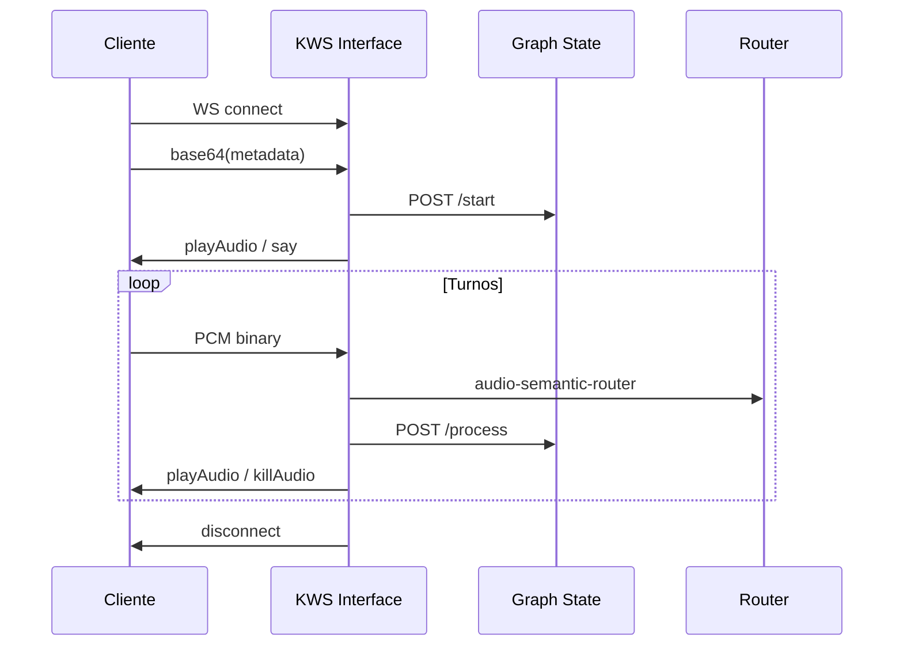

Endpoint principal: `ws://host:8000/` (o `wss://` con TLS).

Endpoints adicionales para voice-to-voice: `/realtime`, `/realtime/xai`, `/realtime/openai`.

## Orden del handshake

<Steps>
  <Step title="Conexión">
    El cliente abre el WebSocket.
  </Step>
  <Step title="Metadata (obligatorio primero)">
    Un único mensaje **texto** con JSON de metadata codificado en **base64**. Hasta recibir metadata válida, el servidor no llama a Graph State.
  </Step>
  <Step title="Audio del usuario">
    Mensajes **binarios**: PCM 16 kHz, 16-bit, mono, en chunks.
  </Step>
  <Step title="Respuestas del servidor">
    Mensajes **texto** JSON: `playAudio`, `playAudioStream`, `killAudio`, `say`, `disconnect`.
  </Step>
</Steps>

## Metadata (schema)

Claves normalizadas a minúsculas en el servidor.

| Campo | Tipo | Descripción |
|-------|------|-------------|
| `call_id` | string | ID único de llamada (recomendado) |
| `graph_id` | string | UUID del grafo (prioridad sobre `graph_name`) |
| `graph_name` | string | Nombre legible del grafo |
| `campaign_name` | string | Campaña |
| `phone_caller`, `lead_id`, `lead_name`, `lead_phone` | string | Datos del lead / webhook |
| `tts_voice_id` | string | Voz TTS para esta llamada |
| `mode` | string | `xai_realtime` o `openai_realtime` para voice-to-voice |

Al menos uno de `graph_id` o `graph_name` (o `FLOW_GRAPH_NAME` en servidor).

### Ejemplo (JavaScript)

```javascript
const metadata = {
  call_id: "01EXAMPLE000000000000000000",
  graph_id: "00000000-0000-4000-8000-000000000001",
  campaign_name: "enero_2026",
  lead_phone: "+525551234567",
  lead_name: "Juan López",
};
const firstMessage = btoa(JSON.stringify(metadata));
websocket.send(firstMessage);
```

## Audio entrante

- Formato: **16 kHz**, **16-bit**, **mono**, little-endian PCM
- El servidor acumula frames para VAD (`VAD_FRAME_DURATION_MS`, típicamente 20 ms)
- Audio vacío o silencioso se descarta sin llamar al router (umbral alineado con Router Detection)

## Mensajes servidor → cliente

### `playAudio`

```json
{
  "type": "playAudio",
  "audioContent": "<base64 WAV 8 kHz telefonía>"
}
```

### `playAudioStream`

Fragmentos PCM para reproducción continua (TTS OpenAI/xAI resampleado a 8 kHz).

### `killAudio` / `killAudioStream`

Interrumpe reproducción actual antes de nuevo audio. Soporta **barge-in**: si el usuario habla durante playback, se cancela y se procesa el nuevo utterance.

### `say` (TTS Layer7)

Con `TTS_PROVIDER=layer7`:

```json
{
  "type": "json",
  "data": {
    "action": "say",
    "text": "¿Confirmas tu identidad?",
    "voice_id": "ES-NN-MX-FEMALE-01"
  }
}
```

El cliente sintetiza y puede enviar `say_started` con `duration_ms`.

### `disconnect`

```json
{
  "type": "disconnect",
  "completed": true
}
```

## Diagrama de secuencia



## Comportamiento especial

- **Nodo final**: si el usuario habla durante el audio de despedida, puede ignorarse; al terminar el audio se envía `disconnect`.
- **Nodo de pago**: solo se registra pago si el usuario afirma en un nodo distinto de "Confirm Identity".
- **Métricas VAD**: ratio de voz, choppiness y SNR por clasificación; expuestas en REST `/api/calls`.
