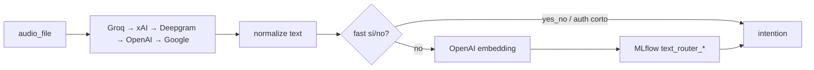

## `transcription` (default)



- Circuit breaker entre proveedores STT
- Orden configurable en `/config` (runtime JSON)
- `NATIVE_AUDIO_FORCE_WAV_SAMPLE_RATE_HZ=8000` corrige cabeceras WAV de telefonía

## `native_audio`

Requiere `GEMINI_API_KEY` y modelos MLflow de audio.

1. Embedding de audio con Gemini
2. Clasificación sklearn desde MLflow (`router_audio/`)

Sin paso STT. Alineado con nodos Graph State `audio_pipeline: native_audio`.

## `llm`

Clasificación con Gemini 2.5 Flash → GPT-4.1 nano → Grok (`utils/llm_classify.py`). Para intenciones fuera del catálogo MLflow estándar cuando Graph State usa `audio_pipeline: llm`.

## Routers por defecto

Definidos en `TEXT_ROUTER_ROUTERS` (warmup al arranque):

`auth`, `ciudad_sede`, `expectativa`, `interest_branch`, `no_payment`, `payment_method`, `rival`, `yes_no`

Cada router necesita en `.env`:

```bash
MLFLOW_AUDIO_MODEL_VERSION_YES_NO=...
MLFLOW_TRANSCRIPTION_MODEL_VERSION_YES_NO=...
```

## Fast path

En `yes_no` y `auth`, respuestas cortas tipo "sí"/"no" pueden clasificarse sin llamada a embeddings.

## Drift

Cada request puede append a `drift_workspace/current/drift_observations.jsonl`. Job externo (`kws-ivr-data-drift`) o manual:

```http
POST /drift/generate
X-API-Key: ...
```

Sube HTML a DigitalOcean Spaces si `DO_SPACES_*` está configurado.
